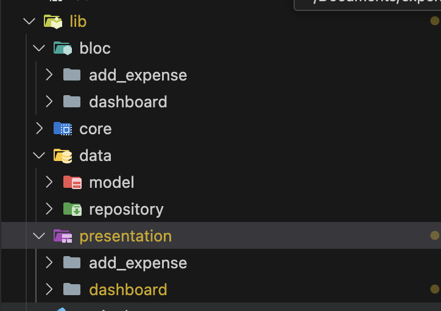
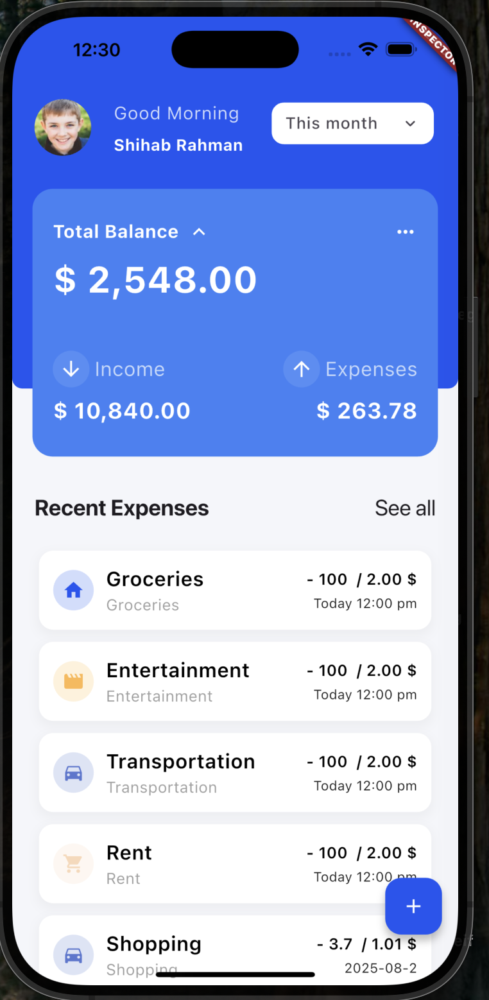
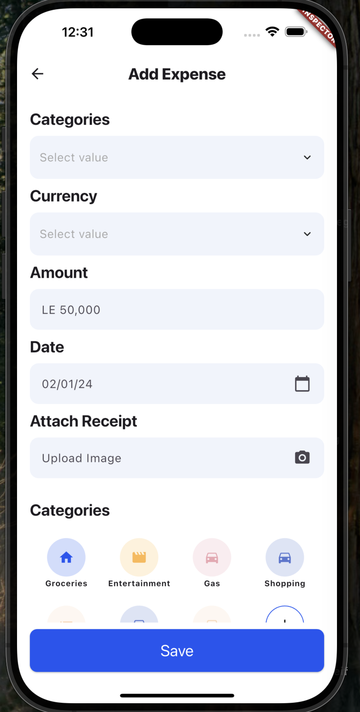

# expenses

A simple expenses app.

## I've used request_inspector to debug network calls

## To see the result install the apk attached apk file with the repo from github actions

Include a clear and complete README.md with:

- Overview of the architecture and structure:
    bloc arch: bloc & data & presentation
    

- State management approach:
    bloc

- How you implemented API integration:
    on expenses & exchange rates 1st checking network call then local hive then network mocking

- Pagination strategy (local vs. API)
    I've simulated pagination on local hive & mockedNetwork

- UI screenshots:
expenses page: 
exchange rates page: 

- Any other relevant information
    No
- Any trade-offs or assumptions:
    I've assumed the user info is hard coded for simplicity & date filter is compared like text not date compare as I've assumed it's backend responsible to filter the data with date

- How to run the project
    1. `flutter pub get`
    2. `flutter run`
- Any known bugs or unimplemented features:
    No known bugs & No testing features included

Bonus (Optional)

- [Finished] CI/CD with GitHub Actions
- [] Animated transitions
- [] CSV or PDF export
